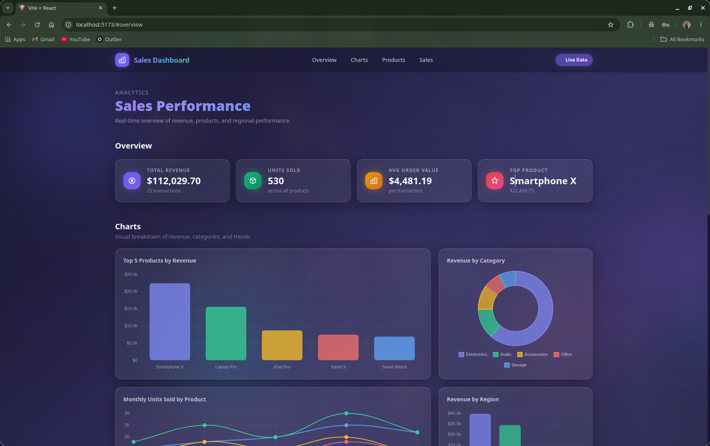
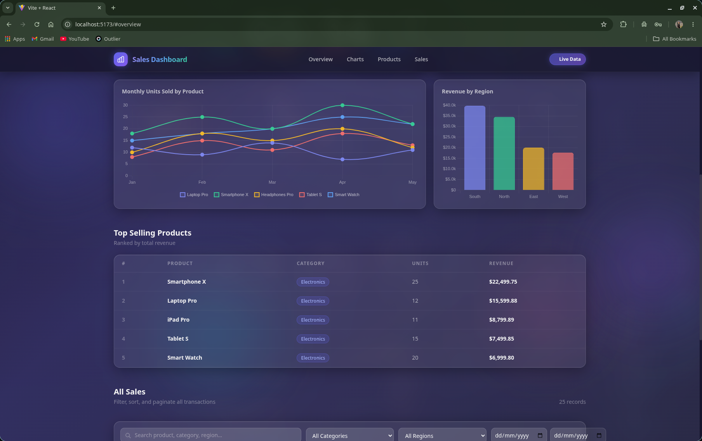
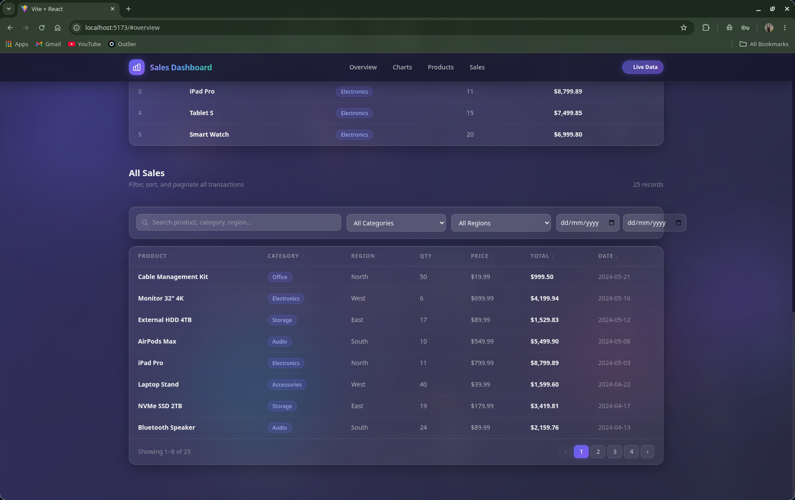

# Sales Performance Dashboard

A full-stack sales analytics dashboard with a glassmorphism UI. Built with React, Node.js/Express, and SQLite — visualizes KPIs, product performance, category breakdowns, and monthly trends through interactive charts and a filterable data table.

---

## UI Showcase







---

## Tech Stack

| Layer    | Technology                              |
|----------|-----------------------------------------|
| Frontend | React 18, Vite, Tailwind CSS, Chart.js  |
| Backend  | Node.js, Express.js                     |
| Database | SQLite (`sqlite3` + `sqlite`)           |

---

## Features

- Glassmorphism UI — frosted glass cards, animated gradient background, ambient orbs
- KPI cards — total revenue, units sold, average order value, top product
- 4 interactive charts — top products bar, category doughnut, monthly line, region bar
- Filterable + sortable sales table with pagination
- Filters by category, region, and date range with live search
- Responsive layout for desktop and mobile
- 6 REST API endpoints with query param support

---

## Project Structure

```
├── assets/                    # UI screenshots
├── sales-backend/
│   ├── server.js              # Express entry point (CORS, logging, error handling)
│   ├── Routes.js              # All API route handlers
│   └── sqlite/
│       ├── initDB.js          # Schema creation + seed data
│       └── sales.db           # SQLite database
│
└── sales-frontend/
    └── src/
        ├── App.jsx            # Root layout + orb background
        ├── index.css          # Glassmorphism styles + animations
        └── components/
            ├── Navbar.jsx     # Sticky glass navbar
            ├── KpiCard.jsx    # KPI summary card
            └── Sales.jsx      # Main dashboard (charts, tables, filters)
```

---

## Getting Started

### Prerequisites

- Node.js v18+
- npm

### 1. Clone the repo

```bash
git clone https://github.com/your-username/sales-dashboard.git
cd sales-dashboard
```

### 2. Backend setup

```bash
cd sales-backend
npm install
node sqlite/initDB.js   # creates sales.db with schema + seed data
npm start               # runs on http://localhost:3000
```

### 3. Frontend setup

Open a new terminal:

```bash
cd sales-frontend
npm install
npm run dev             # runs on http://localhost:5173
```

Vite proxies all `/api` requests to `http://localhost:3000` automatically.

---

## API Endpoints

| Method | Endpoint                  | Description                                                        |
|--------|---------------------------|--------------------------------------------------------------------|
| GET    | `/api/sales-data`         | All sales. Query params: `category`, `region`, `startDate`, `endDate` |
| GET    | `/api/monthly-sales-data` | Monthly units sold and revenue per product                         |
| GET    | `/api/summary`            | KPI totals, top product, category and region breakdown             |
| GET    | `/api/top-products`       | Top N products by revenue. Query param: `limit` (default 5)       |
| GET    | `/api/categories`         | List of distinct product categories                                |
| GET    | `/api/regions`            | List of distinct sales regions                                     |

---

## Author

**Sharnjeet Singh**  
[LinkedIn](https://linkedin.com/in/sharnjeetsingh21)
